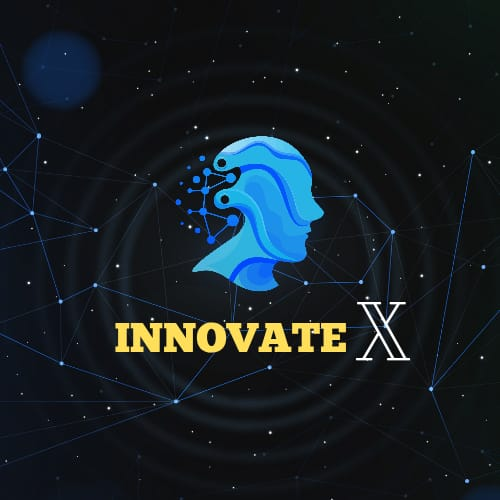
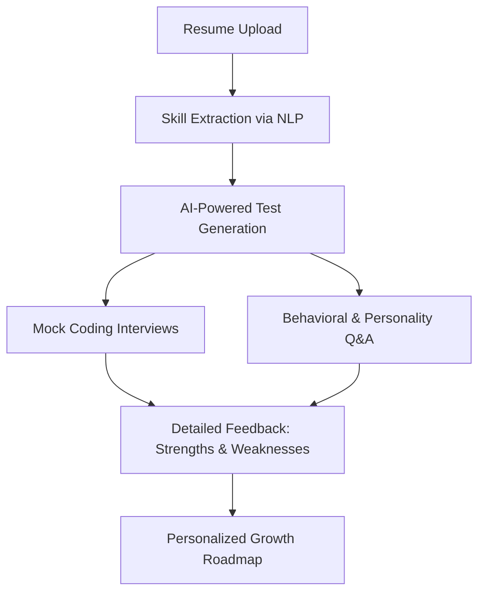
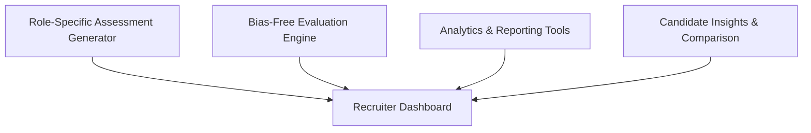
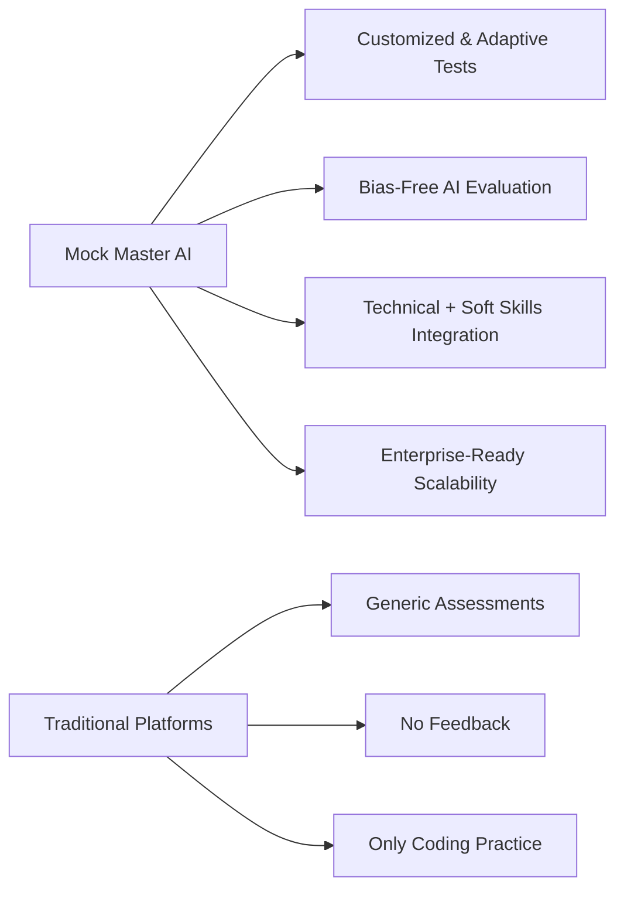
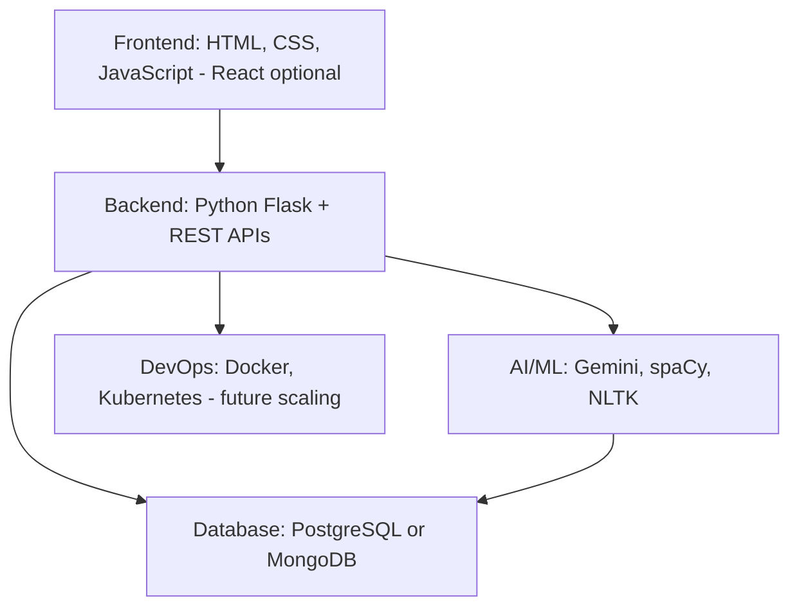
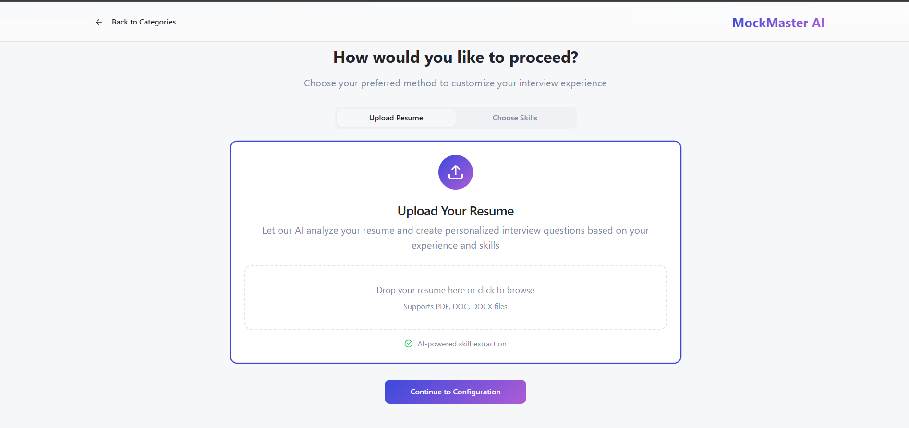

# 🤖 Mock Master AI: Next-Gen Interview Preparation & Recruitment Platform

**Team InnovateX**  
👩‍💻 Project Leader: **Lasya Korandla**

**Customized Skill-Based Interview, Personality Development, and Coding Testing Platform**

  
  
  

**🏆 Built for Hackathons & Scalable to Enterprises**

---

## 🚨 The Problem: Broken Interview Ecosystem

### Candidate Struggles
- 73% face **interview anxiety** (NACE, 2023)  
- 60% drop out due to **irrelevant or generic assessments**  
- Lack of **personalized feedback or adaptive preparation**  
- Coding prep platforms = practice only, not holistic interviews  

### Recruiter Pain Points
- 80% HRs say **screening takes too long** (SHRM, 2024)  
- Manual test creation = **expensive & inefficient**  
- High **bias risk** in evaluations  
- Mismatch between **resume skills vs test difficulty**  

---

## 💡 Mock Master AI: Our Solution

**AI-powered website that:**
- Parses resumes → extracts skills automatically  
- Generates customized coding + interview questions  
- Adapts difficulty in real-time during tests  
- Simulates both **technical & behavioral interviews**  
- Provides detailed analytics & personalized growth roadmap  
- Enables **bias-free scalable evaluation** for recruiters  

---

## 🔑 Key Features
- 🎯 **Customized Assessments** – Tailored questions from resumes  
- 🧠 **Adaptive Testing** – Dynamic difficulty adjustment  
- 🎤 **Mock Interviews** – Covers both technical + soft skills  
- 📊 **Instant Feedback** – Strength/weakness breakdown  
- ⚖️ **Bias-Free Evaluation** – AI-powered scoring system  
- 🏢 **Recruiter Dashboard** – Role-specific assessment & analytics  

---

## 🏗️ System Overview

### Candidate Journey

☁️ Deployment & Scalability

🚀 Dockerized Flask backend for easy deployment

⚡ REST APIs for ATS integration

☸️ Kubernetes-ready for enterprise scaling

🔒 Secure authentication & role-based access (roadmap)

🔮 Roadmap

🎥 AI-powered video interview simulations

## 🌐 Project Links

- 📂 **GitHub Repository** → [Mock Master AI](https://github.com/Xinnovations/MockMaster-AI)  
- 🎥 **Demo Video** → [Watch on YouTube](https://www.youtube.com/watch?v=S7a7Qe4l6W8&lc=Ugx9uCTNETgGE8k4db54AaABAg)  

---

## 🖼️ Screenshots

### 🔹 Candidate Dashboard
.png)

### 🔹 AI-Generated Coding Test

🌍 Multi-language support

🤝 ATS integrations (Workday, Greenhouse, etc.)

📱 Mobile-first candidate app

---

👨‍👩‍👧 Team InnovateX

Lasya Korandla – Project Leader
